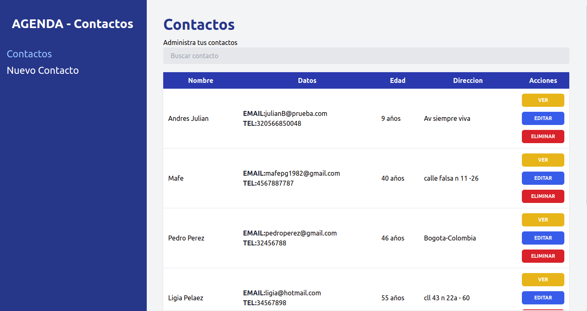
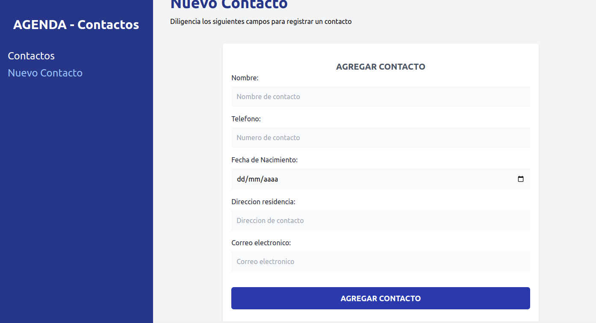

# Phone-book App 👨‍💻 🚀


Aplicacion de agenda telefonica en donde se puede crear, ver, actualizar y eliminar un contacto, ademas de ampliar su busqueda especifica por medio de filtros el cual se puede hacer por nombre y correo del contacto.



Agregando contactos ✅



## Desarrollado con 🛠️

- REACT
- REACT-ROUTER-DOM
- TAILWINDCSS
- FORMIK
- YUP
- JSON-SERVER


## Empezando 👏

Para obtener una copia local en funcionamiento, siga estos pasos:

1. Clonar el repositorio y`cd` para acceder al proyecto

```sh
git clone https://github.com/DiegoBelPe/Phone-book-app.git
cd phone-book-app
```

2. Instalar dependencias

```sh
npm install
```

3. Ejecutar proyecto y `json-server`

```sh
npm run dev
```


Disfruta este proyecto y cuentame tu opiniion 🤩


